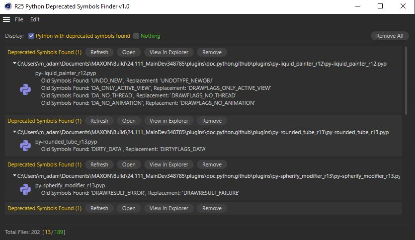

# R25-Python-Deprecated-Symbols-Finder
Utility tool aimed to find all Python symbols being deprecated in R25.

## Introduction

With Cinema 4D R25, around 1000 symbols were deprecated in Python. However rest assured, R25 is not going to be a hard break, and deprecated symbols will keep working for at least a year. Manually looking to a list of 1000 symbols within your files can be difficult, this is why we created this tool.

## Requierement

This plugin is released as it is and supports only R25. If you think there is an important missing feature or a bug please report to us at [Plugin Café support forum](https://plugincafe.maxon.net/). It's not in Maxon's priorities to maintains this tool.

## Installation

This is a regular CommandData plugin, install it within the Cinema 4D plugins folders.

## Usage

Go to the extension menu and click into the "R25 Python Deprecated Symbols Finder v1.0" menu entry.
Within the dialog go to the File menu and choose one of the options according to what you want to scan.
It will then scan folders, to search through *.c4d files, regular *.py files, and plugin files *.pyp.

The tool looks into the next elements of a Cinema 4D scene:

- Python Generator
- Python Effector
- Python Field Object
- Python Field Layer
- Python scripting Tag
- Python interaction tag
- Visual Selector tags are always reported since there is no API  to retrieve Python code.
- Python within an Xpresso tag (if the Python GvNode with the deprecated code live in a protected Xpresso Group, only the protected group is exposed)
- Character Component Tag
- Sketch Material using Python

The source code is not disclosed as inspection tools used within the plugin, could expose protected assets made by the community so we decided to not make it public. If you are interested in the overall plugin architecture, this is an adaption of [C.O.F.F.E.E Filter](https://labs.maxon.net/?p=3235) which is free and open source.
